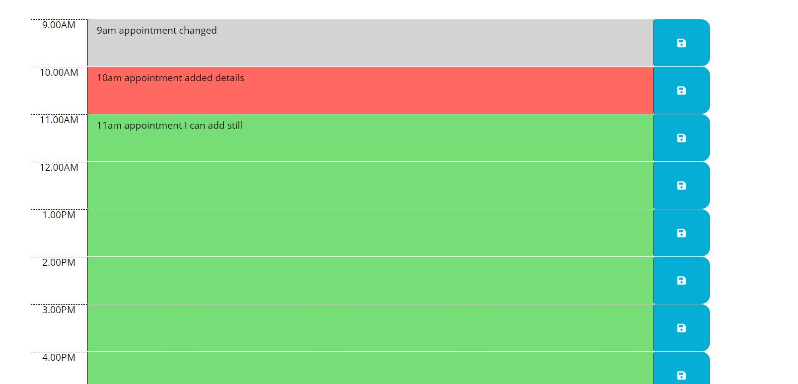
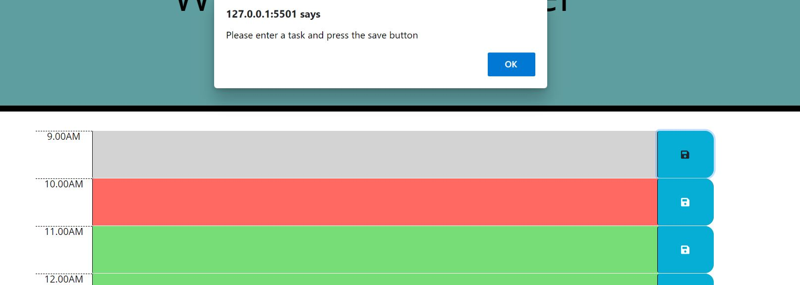
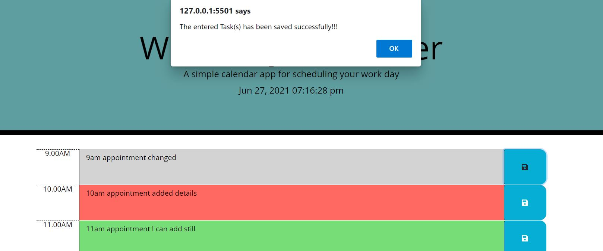
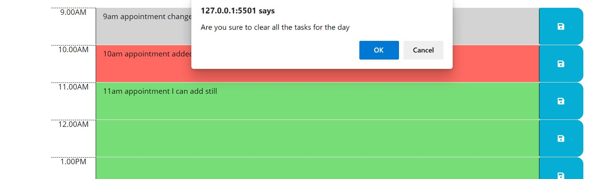

# Work-Day-Planner
Simple calendar application that allows a user to save events for each hour of the day.

# Description
This application helps the users to plan their day. 
This application designed to handle the business hours (9AM to 5 PM)
This is an interactive application, prompt the users while click the application.
This application allows the user to enter the task/appointments/schedules for an hour of the day.
Application save the schedules and user can view it,even if he refresh the page.
Application shows the time slots based on the color codings.

# Installation
Source code can be downloaded from https://github.com/SimonMSelvadurai/Work-Day-Planner 

Source code can be cloned : git@github.com:SimonMSelvadurai/Work-Day-Planner.git 

Page can be launched :  https://simonmselvadurai.github.io/Work-Day-Planner/

### Home Page

https://simonmselvadurai.github.io/Work-Day-Planner/

Once the user clicks the link, Work Day Planner home page will be displayed.
User may able to see the current time on the top of the planner.

User can able to see the block of slots to enter the tasks/ schedules for the day.
This blocks are coded with 3 different colors.
Gray represents the past hour, red shows the current hour and the green shows the future hours.
This application designed to handle the business hours.

This interactive application, make sure the user saves the planner a task.

System gives the response upon saving the tasks.

This application also helps to clear all the tasks of the day and to re-enter.
However the application make sure if the user did not clear it by accident.

# Usage

This application helps to understand the moment, jquery and Bootstrap concepts.

# Credits
https://jquery.com/ 
https://developer.mozilla.org/en-US/docs/Web/JavaScript  
https://getbootstrap.com/docs/5.0/getting-started/introduction/  
https://stackoverflow.com/questions/19269071/how-to-find-the-siblings-of-parent-using-jquery  

